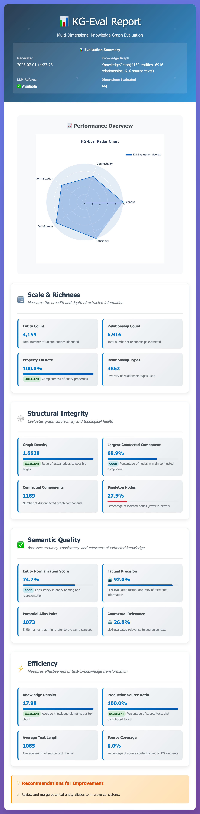

# KG-Eval 📊✨

> A comprehensive framework for evaluating Large Language Models' knowledge graph construction capabilities

[](https://www.python.org/downloads/)
[](LICENSE)
[](https://github.com/astral-sh/uv)

## 🎯 What is KG-Eval?

KG-Eval is a Python framework that provides **multi-dimensional evaluation** of knowledge graphs constructed by Large Language Models (LLMs).

**Traditional evaluation problems**: Only looking at node/edge counts, ignoring quality and structure
**KG-Eval's solution**: Comprehensive evaluation across four dimensions, similar to RAGAs but focused on knowledge graphs

> 📖 **For detailed technical design and methodology**, see [Framework Design Document](FRAMEWORK_DESIGN.md)  
> 🌍 **中文文档**: [README-zh.md](README-zh.md)

### Four Evaluation Dimensions

| Dimension | What It Evaluates | Core Metrics |
|-----------|-------------------|--------------|
| 🔢 **Scale & Richness** | Breadth and depth of extracted information | Entity count, relationship diversity, property completeness |
| 🕸️ **Structural Integrity** | Graph connectivity and topological health | Graph density, connectedness, centrality distribution |
| ✅ **Semantic Quality** | Accuracy, consistency, and relevance | Entity normalization, factual precision, contextual relevance |
| ⚡ **Efficiency** | Text-to-knowledge transformation efficiency | Knowledge density, source coverage |

---

## 🚀 5-Minute Quick Start

### 1. Installation

```bash
# Clone the repository
git clone https://github.com/earayu/KG-Eval.git
cd KG-Eval

# Install with uv (recommended)
uv sync

# Or install with pip
pip install -e .
```

### 2. Environment Setup (Optional)

```bash
# Copy environment configuration template
cp env.template .env

# Edit .env file to add your API keys (for advanced semantic evaluation)
# You can still use basic evaluation without API keys
```

> **💡 Running Python Scripts**: Since this project uses uv for dependency management, you have two options:
> - **Recommended**: Use `uv run python script.py` 
> - **Alternative**: Activate the virtual environment with `source .venv/bin/activate` then use `python script.py`

### 3. Command Line Quick Start (Recommended)

```bash
# Evaluate the demo knowledge graph (auto-generates JSON + HTML reports)
uv run kg-eval evaluate examples/sample_kg.json

# Evaluate your own knowledge graph (auto-generates both formats)
uv run kg-eval evaluate your_kg.json

# Specify custom output path and format
uv run kg-eval evaluate your_kg.json --output custom_report.html --format html

# Compare multiple knowledge graphs
uv run kg-eval compare kg1.json kg2.json --output comparison.html
```

> 💡 **Auto Dual Reports**: The CLI generates both JSON and HTML reports by default, providing structured data and visual analysis instantly!

### 4. Python API Demo (Advanced)

```bash
# Option 1: Run with uv (recommended)
uv run python examples/api_demo.py

# Option 2: Activate virtual environment first
source .venv/bin/activate
python examples/api_demo.py

# View generated reports
open examples/sample_report.html
```

**API demo automatically generates**:
- `sample_kg.json` - Sample knowledge graph data (if not exists)
- `sample_report.json` - Detailed evaluation metrics in JSON format
- `sample_report.html` - Interactive visualization report with radar charts

---

## 💡 Advanced Usage

### Knowledge Graph Data Format

KG-Eval uses standard JSON format:

```json
{
  "entities": [
    {
      "entity_name": "Albert Einstein",
      "entity_type": "Person",
      "description": "Famous physicist"
    }
  ],
  "relationships": [
    {
      "source_entity_name": "Albert Einstein",
      "target_entity_name": "Theory of Relativity",
      "description": "developed",
      "keywords": ["science", "physics"],
      "weight": 0.9
    }
  ],
  "source_texts": [
    {
      "content": "Albert Einstein developed the Theory of Relativity.",
      "linked_entity_names": ["Albert Einstein", "Theory of Relativity"],
      "linked_edges": [["Albert Einstein", "Theory of Relativity"]]
    }
  ]
}
```

### Advanced CLI Options

```bash
# Use custom OpenAI configuration (auto-generates JSON + HTML)
uv run kg-eval evaluate examples/sample_kg.json \
  --openai-model gpt-3.5-turbo \
  --openai-base-url https://your-proxy.com/v1

# Use Anthropic with specific output format
uv run kg-eval evaluate examples/sample_kg.json \
  --anthropic-key "your-key" \
  --anthropic-model claude-3-sonnet-20240229 \
  --output anthropic_report.json --format json

# Evaluate specific dimensions only (auto-generates both formats)
uv run kg-eval evaluate examples/sample_kg.json \
  --dimensions scale_richness structural_integrity

# Environment variables configuration (edit .env file)
# OPENAI_API_KEY=your_openai_key
# OPENAI_BASE_URL=https://api.openai.com/v1  # Optional
# ANTHROPIC_API_KEY=your_anthropic_key
```

### Python API Usage (Advanced)

```python
import json
from kg_eval import KnowledgeGraph, KGEvaluator

# Load knowledge graph from file (like CLI)
with open("examples/sample_kg.json", "r", encoding="utf-8") as f:
    kg_data = json.load(f)
kg = KnowledgeGraph(**kg_data)

# Evaluate knowledge graph
evaluator = KGEvaluator()
results = evaluator.evaluate(kg)

# Generate both JSON and HTML reports automatically
evaluator.report_generator.generate_json_report(results, "my_report.json")
evaluator.report_generator.generate_html_report(results, "my_report.html")

# Get evaluation summary
summary = evaluator.get_evaluation_summary(results)
print(summary["recommendations"])
```

### Configure LLM Referee (Python API)

```python
from kg_eval import OpenAIReferee, AnthropicReferee

# OpenAI configuration
referee = OpenAIReferee(
    api_key="your-key",
    model="gpt-4o-mini",
    base_url="https://api.openai.com/v1"  # Optional: custom API endpoint
)

# Anthropic configuration
referee = AnthropicReferee(
    api_key="your-key", 
    model="claude-3-sonnet-20240229"
)

# Use LLM referee
evaluator = KGEvaluator(llm_referee=referee)
```

---

## 📊 Evaluation Results & Visualization

### Sample HTML Report

Below is a screenshot of KG-Eval's interactive HTML report, showcasing the comprehensive multi-dimensional analysis:



The report includes:
- **Header Summary**: Generation timestamp, knowledge graph stats, and LLM referee status
- **Performance Overview**: Interactive radar chart showing scores across all four dimensions
- **Detailed Metrics**: Comprehensive breakdown of each evaluation dimension with specific scores and recommendations
- **Visual Indicators**: Color-coded performance levels (Excellent, Good, Poor) and emoji indicators

### Generated Report Types

- **HTML Reports**: Interactive detailed analysis
- **JSON Reports**: Structured data for further analysis
- **Radar Charts**: Multi-dimensional performance overview
- **Comparison Tables**: Side-by-side KG comparison

### Evaluation Metrics Explained

**Scale & Richness**:
- Entity count, relationship count
- Property fill rate
- Relationship type diversity

**Structural Integrity**:
- Graph density (using NetworkX analysis)
- Connected components analysis
- Centrality distribution

**Semantic Quality** (requires LLM):
- Entity normalization score
- Factual precision
- Contextual relevance

**Efficiency**:
- Knowledge density per text chunk
- Source text coverage rate

---

## 📚 Documentation & Resources

### Complete Technical Documentation

- **[Framework Design](FRAMEWORK_DESIGN.md)** - Detailed technical specification and design rationale
- **[Examples & Tutorials](examples/README.md)** - Complete usage examples and tutorials
- **[API Reference](docs/api.md)** - Complete API documentation
- **[中文文档](README-zh.md)** - Chinese documentation

### Real-World Applications

- **LLM Knowledge Extraction Evaluation**: Assess different LLMs' KG construction capabilities
- **Prompt Engineering Optimization**: Optimize knowledge extraction prompts through multi-dimensional evaluation
- **Knowledge Graph Quality Monitoring**: Monitor KG quality in production environments
- **Academic Research**: Standardized evaluation tools for KG construction research

### Supported Custom Configurations

- **API Proxies**: Support proxy access to OpenAI/Anthropic
- **Azure OpenAI**: Support Azure OpenAI deployments
- **Self-hosted Models**: Support LocalAI, Ollama, and other local deployments
- **Enterprise API Gateways**: Support enterprise-grade API management

---

## 🛠️ Developer Guide

### Local Development

```bash
# Install development dependencies (after cloning)
uv sync --dev

# Run tests
pytest

# Format code
black src/
isort src/
```

### Contributing

We welcome contributions! Please see our [Contributing Guide](CONTRIBUTING.md) for details.

---

## 🤝 Community & Support

- **GitHub Issues**: [Bug reports & feature requests](https://github.com/earayu/KG-Eval/issues)
- **GitHub Discussions**: [Community discussions](https://github.com/earayu/KG-Eval/discussions)
- **Email**: earayu@163.com

---

## 📄 License

This project is licensed under the MIT License - see the [LICENSE](LICENSE) file for details.

---

## 🙏 Acknowledgments

- Inspired by evaluation frameworks like RAGAs
- Built with modern Python tools (uv, pydantic, networkx, plotly)
- Designed for the growing field of LLM-powered knowledge extraction

---

*KG-Eval: Making knowledge graph evaluation as rigorous as the knowledge itself.* 📊✨